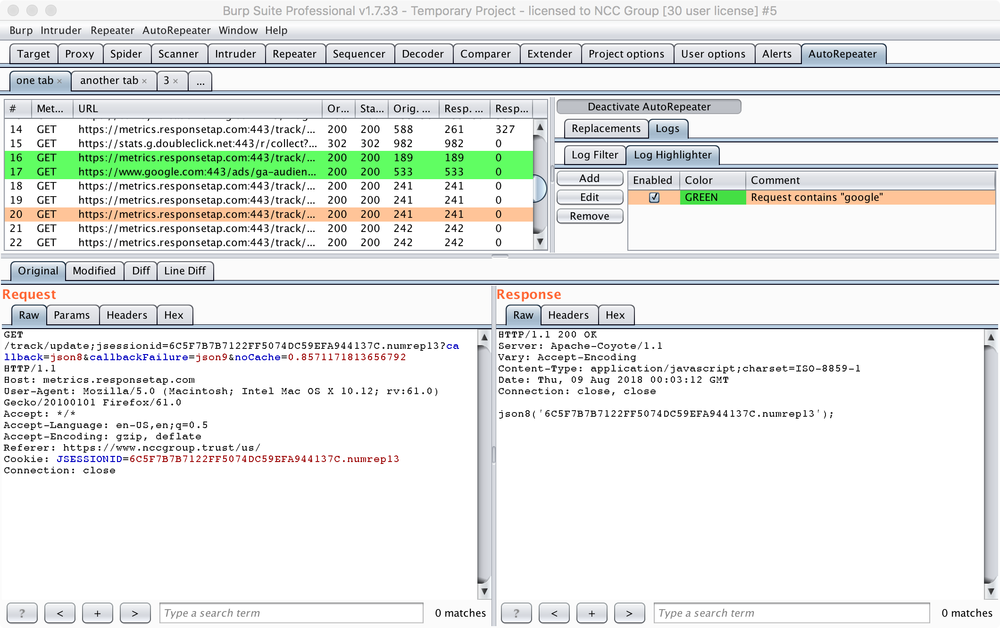

# AutoRepeater: Automated HTTP Request Repeating With Burp Suite

## tl;dr
Within extender import AutoRepeater.jar

## Some Brief Instructions
AutoRepeater will only resend requests which are changed by a defined replacement. When AutoRepeater receives a request that matches the conditions set for a given tab, AutoRepeater will first apply every defined base replacement to the request, then will copy the request with the base replacements performed for each defined replacement and apply the given replacement to the request. 

## Introduction
Burp Suite is an intercepting HTTP Proxy, and it is the defacto tool for performing web application security testing. While Burp Suite is a very useful tool, using it to perform authorization testing is often a tedious effort involving a "change request and resend" loop, which can miss vulnerabilities and slow down testing. AutoRepeater, an open source Burp Suite extension, was developed to alleviate this effort. AutoRepeater automates and streamlines web application authorization testing, and provides security researchers with an easy-to-use tool for automatically duplicating, modifying, and resending requests within Burp Suite while quickly evaluating the differences in responses.

## AutoRepeater
Without AutoRepeater, the basic Burp Suite web application testing flow is as follows:

1. User noodles around a web application until they find an interesting request 
2. User sends the request to Burp Suite's "Repeater" tool
3. User modifies the request within "Repeater" and resends it to the server
4. Repeat step 3 until a sweet vulnerability is found
5. Start again from step 1, until the user runs out of testing time or can retire from bug bounty earnings

While this testing flow works, it is particularly tedious for testing issues that could exist within any request. For example, changing email addresses, account identities, roles, URLs, and CSRF tokens can all lead to vulnerabilities. Currently, Burp Suite does not quickly test for these types of vulnerabilities within a web application.

There are some existing Burp Suite plugins (AuthMatrix, Authz, and Autorize) which exist to make authorization testing easier but each has issues that limit their usefulness. AuthMatrix and Authz require users to send specific requests to the plugins and set up rules for how the authorization testing is performed, which introduces the risk of missing important requests and slows down testing. Autorize does not provide the users with the ability to perform general-purpose text replacements and has a confusing user interface. AutoRepeater takes all the best ideas from these plugins, along with the Burp Suite's familiar user interface, and combines them to create the most streamlined authorization testing plugin.

AutoRepeater provides a general-purpose solution for streamlining authorization testing within web applications. AutoRepeater provides the following features:

+ Automatically duplicate, modify, and resend any request
+ Conditional replacements
+ Quick header, cookie, and parameter value replacements
+ Split request/response viewer
+ Original vs. modified request/response diff viewer
+ Base replacements for values that break requests like CSRF tokens and session cookies
+ Renamable tabs
+ Logging
+ Exporting
+ Toggled activation
+ "Send to AutoRepeater" from other Burp Suite tools

## Sample Usage
Following are some common use cases for AutoRepeater. Some helpful tips when using the tool are:

+ Don't activate autorepeater until you're ready to start browsing.
+ Ensure **Extender** is not using cookies from Burp's cookie jar (**Project Options > Session**).
+ Check early to ensure your replacements are working as expected.
+ Tabs and configuration are preserved after a restart, but data is lost.

### Testing Unauthenticated User Access
To test whether an unauthenticated user can access the application, configure one rule under Base Replacements to **Remove Header By Name** and then match "Cookie".

### Testing Authenticated User Access
To test access between authenticated users (e.g. low privilege to higher privilege), you'll need to define replacements for each of the session cookies used.

1. Make note of the cookie names and values for the lower-privileged session.
2. Configure a rule under Base Replacements for each cookie to **Match Cookie Name, Replace Value**. Match the cookie name, replace with the lower-privileged user's cookie.
3. Repeat for as many roles as you'd like to test.
4. Browse the application as the highest-privileged user.
5. Review the results.

### Reviewing User Access Results
To review the results of access testing, first ensure you're using the latest version of the tool (Git, not BApp store).

1. Sort by **URL**, then by **Resp. Len. Diff.**. Items with a difference of 0 and identical status codes are strong indicators of successful access.
2. Using **Logs > Log Filter** configure exclusions for irrelevant data (e.g. File Extension = (png|gif|css|ico), Modified Status Code = (403|404)).
3. Review the results and manually investigate anything that looks out of place.

## References

+ [BSides Rochester 2018 - AutoRepeater: Automated HTTP Request Repeating With Burp Suite](https://www.youtube.com/watch?v=IYFLp_4ccrw)
